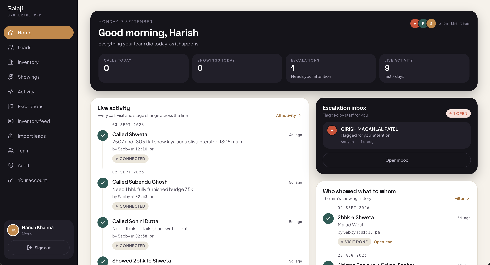
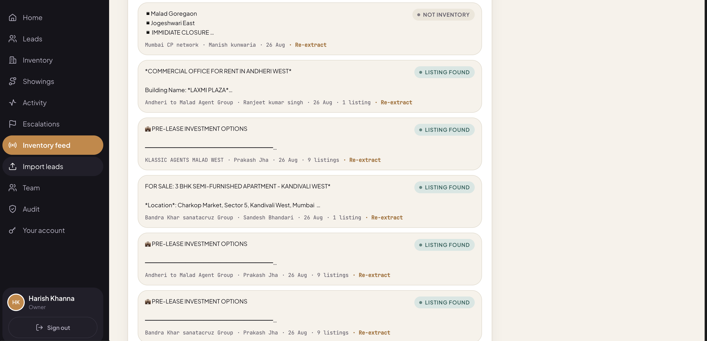
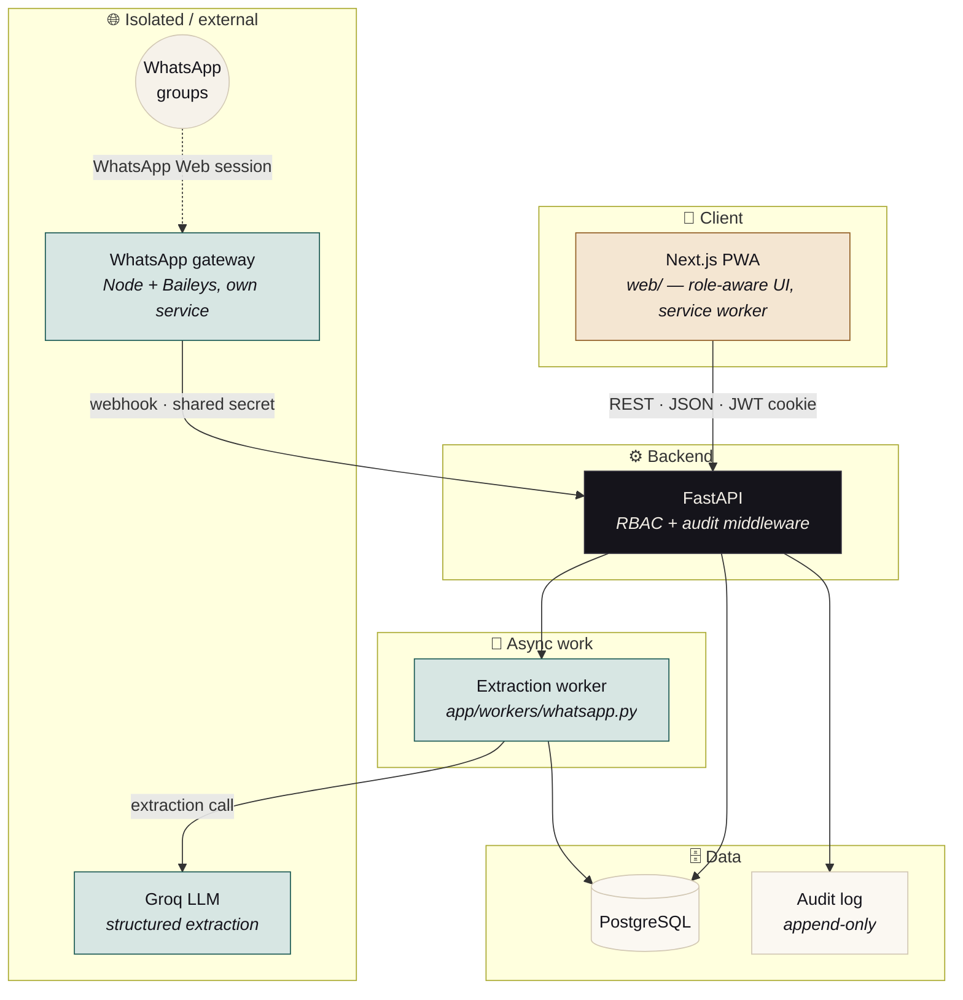
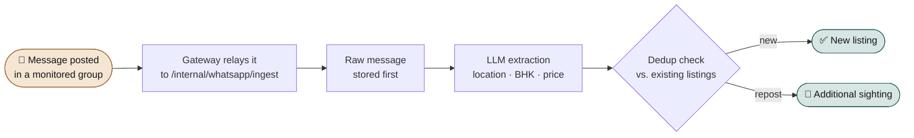
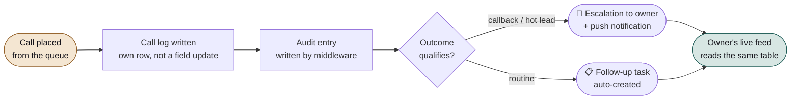
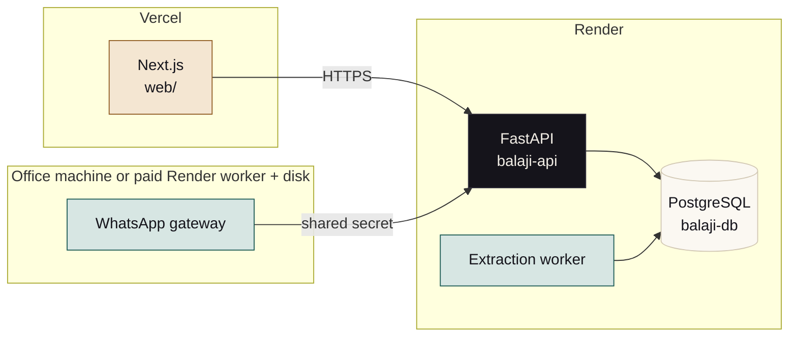

<div align="center">


# Balaji CRM

**The client list stops walking out the door. The owner stops asking "what's happening?"<br/>The inventory stops living in five hundred WhatsApp groups.**

An internal CRM for a small real-estate brokerage — role-scoped leads, a cold-calling
workflow, an immutable audit trail, and a WhatsApp feed that turns broker-group
chatter into one de-duplicated, searchable inventory.

[](web)
[](backend)
[](docs/DATA_MODEL.md)
[](web)
[](backend)

[](web)
[](docs/WHATSAPP_INGESTION.md)
[](backend/tests)
[](docs)

<sub>Built from the docs down — every route, permission, and table in this README was read out of the running code, not the plan for it.</sub>

</div>

<br/>

<a id="screenshots"></a>
<div align="center">

### 📸 The owner's home screen, and the WhatsApp inventory feed it never has to type by hand

<table>
<tr>
<td width="50%">

<p align="center"><sub><b>Home</b> — every call, visit, and stage change across the firm, live</sub></p>
</td>
<td width="50%">

<p align="center"><sub><b>Inventory feed</b> — raw WhatsApp posts, extracted into structured listings automatically</sub></p>
</td>
</tr>
</table>

</div>

<br/>

<a id="toc"></a>
## 📖 Table of contents

<table>
<tr><td width="50%" valign="top">

- [📸 Screenshots](#screenshots)
- [🧩 The problem](#problem)
- [✅ The solution](#solution)
- [✨ Feature highlights](#features)
- [🏗️ Architecture](#architecture)
- [🔄 End-to-end data flows](#dataflows)

</td><td width="50%" valign="top">

- [🧱 Tech stack](#stack)
- [🔐 Roles, permissions & security](#security)
- [🚀 Getting started](#getting-started)
- [📲 WhatsApp inventory feed](#whatsapp)
- [☁️ Deployment](#deployment)
- [📚 Documentation](#docs)

</td></tr>
</table>

<br/>

<a id="problem"></a>
## 🧩 The problem

> A small real-estate brokerage — an owner plus closing agents and a cold-calling
> team — runs entirely on **WhatsApp, phone calls, and scattered notes.**

<table>
<tr>
<td width="33%" valign="top">

### 📦 No unified inventory
Listings are scattered across hundreds of
WhatsApp broker groups. Agents scroll chat
history and rely on memory to find matching
inventory for a client.

</td>
<td width="33%" valign="top">

### 👁️ No owner visibility
The owner has no way to know which agent
is showing which property to which client,
or whether a lead is actually being
followed up.

</td>
<td width="33%" valign="top">

### 🔓 Data leakage risk
No access control, no audit trail. An
agent can walk away with the firm's
entire client list — the stated,
real risk this project exists to close.

</td>
</tr>
</table>

<br/>

<a id="solution"></a>
## ✅ The solution

Each problem gets a **structural** fix — enforced in the query layer or middleware,
not a checkbox a future screen can forget to tick.

| Problem | Mechanism | Where it lives |
|---|---|---|
| 📦 Scattered inventory | A gateway reads the firm's WhatsApp groups directly; an LLM extracts structured listing fields and de-dupes reposts into one inventory | `gateway/`, `backend/app/workers/whatsapp.py` |
| 👁️ No owner visibility | Every call, visit, and "shown to client" event is its own row — the owner's live feed reads the *same* table as the truth, no separate reporting pipeline to drift | `backend/app/routers/activities.py`, `showings.py` |
| 🔓 Leakage risk | RBAC enforced at the query layer, not the UI; bulk export exists only for Owner/Manager and is itself logged; audit logging is middleware, not opt-in | `backend/app/rbac.py`, `scoping.py`, `audit.py` |

<div align="center">
<sub><b>The realistic threat modeled here isn't an external hacker — it's an insider with legitimate login access.</b><br/>Every access decision below is designed against that threat specifically. See <a href="docs/SECURITY_MODEL.md">SECURITY_MODEL.md</a>.</sub>
</div>

<br/>

<a id="features"></a>
## ✨ Feature highlights

<table>
<tr><td valign="top">

**🧑‍💼 Core CRM**
- Role-scoped leads, masked phone numbers until a qualifying interaction is logged
- Property inventory — manual + WhatsApp-sourced, one searchable view
- Site-visit / showing tracker: who showed what to whom, when
- One-tap call logging — outcome, temperature, notes
- Owner activity feed, escalation inbox, team performance view
- Immutable append-only audit log with an Owner-facing viewer
- Bulk lead import (CSV/XLSX) with fuzzy dedup
- Web-push notifications for follow-ups and escalations

</td><td valign="top">

**📲 WhatsApp inventory pipeline**
- Node + Baileys gateway holds a real WhatsApp Web session
- Messages journalled raw before parsing — a prompt fix replays over history
- Groq LLM extraction with a JSON schema, plus cheap pre-filtering of chatter
- Multi-model rotation so one model's rate limit doesn't stall the queue
- Fuzzy dedup merges reposts of the same flat into one listing, many sightings
- In-app pairing flow — QR code and group picker, no terminal required

</td></tr>
</table>

<br/>

<a id="architecture"></a>
## 🏗️ Architecture



<sub>Every arrow above is an HTTP call carrying a shared secret, not a shared process — the gateway and the extraction worker fail independently without taking the core CRM down.</sub>

| Component | Role |
|---|---|
| **Frontend — Next.js PWA** | Role-aware routing (Owner / Agent / Cold Caller each land differently); browser never calls FastAPI directly — every request proxies through `/api/crm/[...path]`, which attaches the session JWT from an httpOnly cookie |
| **Backend — FastAPI** | RBAC middleware resolves the caller's role on *every* request and scopes queries at the SQL level; audit middleware wraps every read/write on sensitive resources |
| **Database — PostgreSQL** | Soft delete everywhere (`deleted_at`), never hard delete; every interaction is its own row, never a mutable field |
| **WhatsApp gateway** | Deliberately a separate Node service — the one component on an unofficial integration, isolated so its failure mode can't take down the core CRM |

<br/>

<a id="dataflows"></a>
## 🔄 End-to-end data flows

<details open>
<summary><b>📦 WhatsApp listing → searchable inventory</b></summary>
<br/>



</details>

<details>
<summary><b>📞 Cold call → owner visibility</b></summary>
<br/>



</details>

<br/>

<a id="stack"></a>
## 🧱 Tech stack

| Layer | Choice | Why |
|---|---|---|
| **Frontend** | Next.js 16 (App Router) · React 19 · TypeScript · Tailwind CSS 4, installable PWA | One codebase, mobile-first, no App Store review cycle |
| **Backend** | FastAPI 0.115 · Python 3.12 · Pydantic 2 · SQLAlchemy 2.0 · Alembic | Async-friendly, fast to build REST APIs, good fit for background extraction jobs |
| **Database** | PostgreSQL | Relational integrity for leads/deals/roles; JSONB where fields are genuinely flexible |
| **Auth** | JWT (`python-jose`) + bcrypt · httpOnly cookie sessions | Role claim embedded in token; sliding-expiry sessions with an absolute cap |
| **WhatsApp gateway** | Node 22 · `@whiskeysockets/baileys` 6.7 | No official WhatsApp Business API can read group messages — this is the only way in |
| **LLM extraction** | Groq API, JSON-schema structured output | High throughput, low cost for a copy-out-of-messy-text task, not a reasoning one |
| **Dedup** | `rapidfuzz` | Fuzzy string matching for contacts and property listings |
| **Notifications** | Web Push (`pywebpush` + VAPID) | Native to the PWA approach, no separate mobile push service |
| **Testing** | `pytest` (118 backend tests) · `tsc` + `next build` | Correctness risk concentrates in RBAC, dedup, and extraction logic |

<br/>

<a id="security"></a>
## 🔐 Roles, permissions & security

| Capability | 👑 Owner | 🧑‍💼 Agent | ☎️ Cold Caller |
|---|:---:|:---:|:---:|
| View all contacts firm-wide | ✅ | Own only | ❌ |
| Bulk export contacts | ✅ | ❌ | ❌ |
| View unmasked phone/email | ✅ | After first interaction | Number being called only |
| Delete a contact or property | ✅ | ❌ | ❌ |
| View firm-wide activity feed | ✅ | Own only | Own only |
| View the audit log | Full | ❌ | ❌ |
| Configure WhatsApp ingestion | ✅ | ❌ | ❌ |

<table>
<tr><td valign="top">

**Threat model**
Not an external hacker — an insider with
legitimate login access trying to extract
the client list before leaving. Mitigated
with mandatory pagination, masking, and
zero export capability for Agent/Cold
Caller *at the API level*, not just hidden
in the UI.

</td><td valign="top">

**Audit logging**
Structural, via middleware wrapping every
sensitive request — no endpoint has to
remember to log. Where the database
allows it, `UPDATE`/`DELETE` on `audit_log`
is revoked from the app's own DB role.

</td><td valign="top">

**Sessions**
Sliding expiry with an absolute cap — a
token renews itself while in use but can
never outlive a fixed ceiling from first
login, so no amount of use makes a
session permanent.

</td></tr>
</table>

Full detail: [`SECURITY_MODEL.md`](docs/SECURITY_MODEL.md) · [`ROLES_PERMISSIONS.md`](docs/ROLES_PERMISSIONS.md)

<br/>

<a id="getting-started"></a>
## 🚀 Getting started

Requires **PostgreSQL**, **Python 3.12+**, and **Node 20+**.

```bash
# 1 — database roles + schema
createdb balaji_crm
psql balaji_crm -c "CREATE ROLE balaji_app LOGIN PASSWORD 'balaji_dev_pw';"
psql balaji_crm -c "CREATE ROLE balaji_migrator LOGIN PASSWORD 'balaji_dev_pw';"

# 2 — backend
cd backend
python3 -m venv .venv && ./.venv/bin/pip install -r requirements.txt
cp .env.example .env          # fill in JWT_SECRET, and Phase-3 keys if used
./.venv/bin/alembic upgrade head
./.venv/bin/python -m app.seed --reset
./.venv/bin/uvicorn app.main:app --port 8000

# 3 — frontend
cd ../web && npm install && npm run dev     # → http://localhost:3000
```

> Seeded logins are printed by `app.seed`; all use the password `balaji123`.

<br/>

<a id="whatsapp"></a>
## 📲 WhatsApp inventory feed

Optional, and the most involved part — full write-up in
[`WHATSAPP_INGESTION.md`](docs/WHATSAPP_INGESTION.md). The constraint that
shapes it: **no official WhatsApp API can read group messages**, so this
drives a real account over WhatsApp Web. Use a dedicated number.

```bash
cd gateway && npm install && cp .env.example .env   # same secret as backend/.env
npm run pair      # QR-pair the account
npm run groups    # list group ids, then add them in the CRM (Owner → Inventory feed)
npm start

cd ../backend && ./.venv/bin/python -m app.workers.whatsapp   # extraction worker
```

Messages are stored raw before parsing, so a prompt fix can be replayed over
history. Reposts of the same flat merge into one listing rather than
duplicating it, and every sighting is kept so provenance stays auditable.

<br/>

## 🧪 Tests

```bash
cd backend && ./.venv/bin/pytest      # 118 tests
cd web && npx tsc --noEmit && npm run build
```

<br/>

<a id="deployment"></a>
## ☁️ Deployment

**Render** (API + Postgres + extraction worker) and **Vercel** (frontend) —
about 20 minutes end to end. Full walkthrough in
[`DEPLOYMENT.md`](docs/DEPLOYMENT.md); a `render.yaml` blueprint is included.



| Piece | Host | Cost |
|---|---|---|
| Frontend | Vercel (Hobby) | Free |
| API | Render Web Service | Free, sleeps after 15 min idle |
| Database | Render PostgreSQL | Free 90 days, then ~$7/mo |
| Extraction worker | Render Background Worker | ~$7/mo — only needed for the WhatsApp feed |
| WhatsApp gateway | Office machine *(recommended)* or Render Worker + disk | Free / ~$7/mo + disk |

<sub>A working CRM without the WhatsApp feed costs nothing beyond the database, after the first 90 days.</sub>

<br/>

## 🗂️ Project layout

```
backend/    FastAPI app, migrations, extraction worker, tests
web/        Next.js PWA
gateway/    WhatsApp ingestion gateway — separate service, own box
docs/       PRD, architecture, data model, security model, roles matrix
```

<br/>

<a id="docs"></a>
## 📚 Documentation

| Document | Covers |
|---|---|
| [`PRD.md`](docs/PRD.md) | Problem statement, goals, user stories |
| [`ARCHITECTURE.md`](docs/ARCHITECTURE.md) | System design, component responsibilities |
| [`TECH_STACK.md`](docs/TECH_STACK.md) | Stack choices and rationale |
| [`DATA_MODEL.md`](docs/DATA_MODEL.md) | Full schema, DDL, indexing decisions |
| [`SECURITY_MODEL.md`](docs/SECURITY_MODEL.md) | Threat model, access control, audit logging |
| [`ROLES_PERMISSIONS.md`](docs/ROLES_PERMISSIONS.md) | Full permission matrix by role |
| [`API_SPEC.md`](docs/API_SPEC.md) | Endpoint reference |
| [`DESIGN_RULES.md`](docs/DESIGN_RULES.md) | UI/UX rules the interface obeys |
| [`WHATSAPP_INGESTION.md`](docs/WHATSAPP_INGESTION.md) | The inventory pipeline, end to end |
| [`DEPLOYMENT.md`](docs/DEPLOYMENT.md) | Render + Vercel, step by step |

**Two rendered references**, generated from the code rather than the plan for it:

- 📘 [`BALAJI_CRM_REFERENCE.pdf`](docs/BALAJI_CRM_REFERENCE.pdf) — product & UX reference: every screen each role reaches, the user flows, and a master prompt for redesign work
- 📗 [`BALAJI_CRM_TECH_OVERVIEW.pdf`](docs/BALAJI_CRM_TECH_OVERVIEW.pdf) — this README's companion, in depth: problem statement, architecture, full data flows, and deployment topology

<br/>

<div align="center">
<sub>Built around two problems the brokerage actually stated — not features bolted on after the fact.</sub>
</div>
